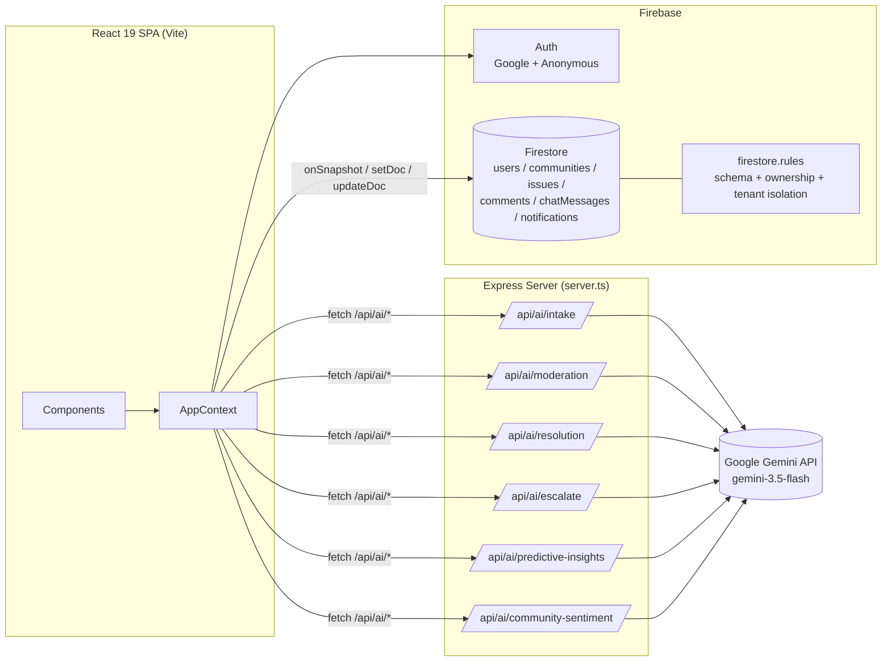

<div align="center">

# 🛰️ CivicPulse
### Every voice. Every street. Every fix.

**An AI-powered hyperlocal civic issue reporting and resolution platform.**

Citizens report neighborhood hazards with a photo. A Gemini-backed agent pipeline triages, deduplicates, routes, and tracks them through to resolution — with real-time community chat, gamified verification, and full public transparency along the way.


Built for **codingninjas x Google for Developers Vibe2Ship Hackathon** — *Community Hero: Hyperlocal Problem Solver* track.
>[](https://civicpulse-144494447181.us-west1.run.app/)

</div>

---

## Table of Contents

- [Overview](#overview)
- [Key Features](#key-features)
- [The Agentic Pipeline](#the-agentic-pipeline)
- [System Architecture](#system-architecture)
- [Tech Stack](#tech-stack)
- [Data Model](#data-model)
- [Security Model](#security-model)
- [Gamification & Engagement](#gamification--engagement)
- [Maps & Geolocation](#maps--geolocation)
- [Project Structure](#project-structure)
- [Getting Started](#getting-started)
- [Demo Access & Roles](#demo-access--roles)
- [Design System](#design-system)
- [Roadmap](#roadmap)
- [Author](#author)

---

## Overview

**CivicPulse** organizes municipal issue reporting (potholes, water leaks, broken streetlights, garbage overflow, damaged property) around **non-overlapping, geofenced neighborhood "catchments."** Every citizen belongs to exactly one catchment. Inside it, they can:

- File a photo-backed hazard report that a Gemini vision agent auto-classifies and triages.
- Verify or upvote existing reports — including duplicates flagged automatically within a 150m radius.
- Coordinate in a real-time, AI-moderated neighborhood chat.
- Watch reports move through an official dispatch queue (`Reported → Reviewed → In Progress → Completed`).
- Earn points and badges, and track their personal civic footprint on an interactive map.
- View AI-generated predictive insights and live community sentiment scores.

A separate **Department Queue** view gives municipal staff a severity-sorted dispatch console where resolving a report automatically drafts a public resolution summary and distributes reward points.

---

## Key Features

### 📍 Geofenced Communities
- Communities are circular catchments (`centerLat`, `centerLng`, `radiusKm`, 0.5–5 km) drawn and joined on an interactive Leaflet map.
- Joining requires the citizen's location (real GPS or a draggable pin) to fall inside the catchment radius (Haversine distance check).
- A **First-Run Welcome** flow detects an empty database and guides the very first user to either create or join a neighborhood.

### 📷 AI-Powered Issue Intake
- Uploading a photo (or selecting a sample preset) sends it to a server-side Gemini multimodal endpoint that returns a refined title, description, severity, category, and municipal routing tag.
- If no API key is configured, or the call fails, the UI falls back to local keyword-based classification so the form is never blocked.

### 🧭 Geo-Duplicate Detection
- Before a report is submitted, CivicPulse scans open issues of the same category in the same community within **150 meters** and intercepts the submission with a duplicate warning.
- The citizen can choose to upvote and attach their photo as corroborating evidence to the existing report instead of creating a new one.

### 🛡️ Official Dispatch Console
- A passcode-gated (`CIVIC2026`) **Department Queue** view lets staff move issues through their lifecycle, sorted by severity (Critical → Low) then by age.
- Marking an issue complete triggers an AI resolution agent that validates the repair note and drafts a public-facing resolution summary, then awards bonus points to the reporter and every upvoter.

### 📨 Escalation Letters
- Any open issue can be manually escalated — Gemini drafts a formal, ready-to-copy administrative letter to city authorities, citing severity, days open, and citizen endorsement count.

### 💬 Real-Time Moderated Chat
- A community-scoped chat channel screens every outgoing message through an AI moderation check before persisting it to Firestore.
- Issues can be shared into chat as interactive cards that deep-link back to the full report.

### 📊 Transparency & Predictive Analytics
- The **Impact Dashboard** toggles between a citizen's own neighborhood and a city-wide public view, surfacing category/severity breakdowns, completion rate, AI-generated predictive maintenance insights, and a live community sentiment score derived from recent chat activity.

### 🏆 Gamification & Personal Impact
- Points for reporting, verifying, chatting, and resolving issues; a 7-badge medallion cabinet; a per-community leaderboard; and a personal "Impact Sandbox" map plotting a citizen's own reports and verifications as a chronological footprint trail.

### 🔔 Live Notifications & Proximity Alerts
- Real-time toast + bell-dropdown notifications fire on report updates, escalations, and chat activity.
- A background geolocation watcher compares the citizen's live (or simulated) position against open **Critical** severity issues and surfaces a proximity banner within 200 meters — with a built-in GPS simulator for demoing the feature without leaving your desk.

### 🖨️ Audit-Ready Export
- Every issue detail page can export a print-formatted PDF audit document — letterhead, metadata grid, chronological activity timeline, status-transition log, evidence gallery, and community comments — plus a shareable deep link (`?issueId=...`).

---

## The Agentic Pipeline

CivicPulse ships with a dedicated in-app **"Agent Blueprint"** screen documenting its 9-agent reporting-to-resolution pipeline. Six agents are powered by dedicated Gemini-backed REST endpoints in `server.ts`; the remaining three are deliberately implemented as deterministic client-side logic (geometry/sorting), reserving LLM calls for genuinely ambiguous natural-language and vision tasks rather than using AI everywhere by default.

| # | Agent | Trigger | How it works |
|---|-------|---------|---------------|
| 1 | **Intake & Vision Agent** | Photo upload / preset selection | Gemini multimodal model (`gemini-3.5-flash`) parses the image + text into title, description, category, severity, and routing tag. **`POST /api/ai/intake`** |
| 2 | **Geo-Duplicate Agent** | Report submission | Client-side Haversine query against open, same-category issues in the community within 150m; intercepts submission with a merge prompt. |
| 3 | **Priority & Routing Agent** | Queue render | Severity-weighted sort (Critical → Low, then oldest-first) combined with the routing tag assigned at intake, driving the department dispatch view. |
| 4 | **Verification & Upvote Agent** | Upvote / corroborating photo | Enforces one verification per citizen; an optional confirmation photo is re-run through the Intake vision pipeline to validate it matches the reported hazard. |
| 5 | **Predictive Insights Agent** | Impact Dashboard load | Aggregates a community's (or the city's) open issue set into up to 3 proactive maintenance recommendations. **`POST /api/ai/predictive-insights`** |
| 6 | **Resolution Agent** | Staff marks "Resolve" | Validates the technical repair note against the original report and drafts a polished, public-facing resolution summary. **`POST /api/ai/resolution`** |
| 7 | **Escalation Agent** | Manual "Force Escalate" | Drafts a formal letter to city authorities citing severity, days open, and upvote count. **`POST /api/ai/escalate`** |
| 8 | **Community Geo-Validation Agent** | Community creation | Client calls a geo-validation endpoint to resolve and check the proposed catchment's center against existing boundaries before allowing creation. |
| 9 | **Chat Moderation Agent** | Every chat message | Screens message text for harassment, spam, or off-topic political content before it's persisted. Server logic implemented at **`POST /api/ai/moderation`**. |

Every Gemini endpoint in `server.ts` ships with a deterministic stub fallback (e.g. `severity: "Medium"`, `approved: true`) so the **entire app remains fully demoable even without a configured `GEMINI_API_KEY`** — a deliberate resilience choice for live demos and judging environments.

A separate **`POST /api/ai/community-sentiment`** endpoint (beyond the 9 named agents) powers the live community morale score shown on the Impact Dashboard, analyzing recent chat logs for a 0–100 sentiment rating, thematic keywords, and a short morale summary.

---

## System Architecture

CivicPulse intentionally avoids a traditional CRUD-over-REST backend. Almost all application data flows **directly between the React client and Firestore** via the Firebase SDK, secured entirely by `firestore.rules`. The Express server's only job is to act as a **thin, secure proxy for Gemini calls** — keeping `GEMINI_API_KEY` off the client entirely.



In development, `server.ts` mounts Vite in **middleware mode** for hot module reload; in production it serves the static `dist/` build and falls back to `index.html` for client-side routing (single-page app).

---

## Tech Stack

| Layer | Technology |
|---|---|
| **Frontend** | React 19, TypeScript 5.8, Vite 6, Tailwind CSS 4 (CSS-first `@theme` config via `@tailwindcss/vite`) |
| **UI/Icons** | `lucide-react` |
| **Maps** | Leaflet 1.9 + CartoDB "Voyager" tiles / OpenStreetMap |
| **Backend** | Node.js ≥ 22, Express 4, `tsx` (dev), `esbuild` (production bundling) |
| **AI** | `@google/genai` SDK → Gemini (`gemini-3.5-flash`), structured JSON via `responseSchema` |
| **Database/Auth** | Firebase 12 — Firestore (realtime listeners) + Firebase Auth (Google popup + Anonymous) |
| **Hosting** | Firebase Hosting (`firebase.json`, SPA rewrite to `index.html`) |

---

## Data Model

Defined in `firebase-blueprint.json` and `src/types.ts`, enforced in `firestore.rules`:

| Collection | Purpose | Key Fields |
|---|---|---|
| `users/{userId}` | Citizen/official profile | `uid`, `name`, `photoURL`, `communityId`, `points`, `badges[]`, `role: citizen \| official` |
| `communities/{communityId}` | Geofenced catchment | `centerLat`, `centerLng`, `radiusKm`, `createdByUid`, `memberUids[]`, `createdAt` |
| `issues/{issueId}` | Reported hazard | `title`, `description`, `category`, `severity`, `status`, `lat/lng`, `mediaUrls[]`, `upvoteCount`, `upvoterUids[]`, `aiReasoningLog[]`, `statusHistory[]`, `resolutionSummary`, `routingTag` |
| `comments/{commentId}` | Issue discussion thread | `issueId`, `uid`, `userName`, `text`, `createdAt` |
| `chatMessages/{chatId}` | Community chat | `communityId`, `uid`, `text`, `type: text \| issueShare`, `moderationStatus`, `linkedIssueId` |
| `notifications/{notificationId}` | Per-user alerts | `uid`, `type: issue_update \| chat_message \| issue_escalation`, `isRead`, `linkedIssueId` |

`firestore.indexes.json` defines 8 composite indexes covering the app's real query patterns, including:
- `issues`: `communityId + category + status`, `communityId + createdAt desc`, `status + upvoterUids (array-contains)`
- `chatMessages`: `communityId + moderationStatus + createdAt` (asc & desc)
- `notifications`: `uid + createdAt desc`
- `users`: `communityId + points desc` (leaderboard)

---

## Security Model

`firestore.rules` implements a **default-deny** posture with strict, per-collection validation:

- **Global safety net** — every path is denied by default; access is opened up explicitly per collection.
- **Schema enforcement** — dedicated `isValid*()` functions whitelist field names, types, string lengths, and enums (e.g. `severity ∈ {Low, Medium, High, Critical}`, `status ∈ {Reported, Reviewed, In Progress, Completed}`) on every write.
- **Field-diff–gated updates** — e.g. a user profile update is only permitted if the changed keys are *exactly* `['communityId']` or *exactly* `['points', 'badges']`, preventing arbitrary field tampering even by an authenticated owner.
- **Tenant isolation** — reads on `issues`, `comments`, and `chatMessages` require the requester's own `communityId` (resolved via a live Firestore `get()` against `/users/{uid}`) to match the resource's `communityId` — isolation enforced at the database layer, not just the client UI.
- **Demo-friendly ownership** — `isOwner()` accepts a real Firebase Auth UID match *or* a `demo_*` / `seed_*` prefixed UID pattern, allowing anonymous demo sessions and database seeding without weakening real-account protections.
- **Notifications** are readable only by their owning `uid`.

---

## Gamification & Engagement

| Action | Reward |
|---|---|
| File a new report | **+50 pts** (+ `first_report` badge on the first one) |
| Upvote / verify a report | **+10 pts** (+ `verified_citizen` badge on the first one) |
| Send a chat message | **+5 pts** |
| Your report is resolved | **+100 pts** (+ `neighborhood_hero` badge) |
| You verified a now-resolved report | **+20 pts** |

A **Leaderboard** ranks citizens per-community by points, and a 7-badge "Medallion Cabinet" (`STATIC_BADGES` — *Neighborhood Hero, First Responder, Civic Champion, Guardian Angel, Vigilant Eye, Consensus Builder, Master Repairer*, each a DiceBear-generated icon) is displayed on every profile. A personal **"Impact Sandbox"** renders a Leaflet map of the citizen's own reported (📢) and verified (▲) issues connected by a chronological amber footprint trail.

---

## Maps & Geolocation

- All mapping is built on **Leaflet.js** with CartoDB "Voyager" basemap tiles — no Google Maps dependency.
- Catchment boundaries render as draggable, clickable circles; reporting pins are draggable and click-to-place.
- Real device GPS is requested and continuously watched (`navigator.geolocation.watchPosition`) for live proximity alerting, with a manual map-drag fallback when permission is denied or unsupported, and a one-click **GPS simulator** for demo purposes.
- Distance calculations throughout the app use a hand-rolled **Haversine formula** for accurate great-circle distance in kilometers.

---

## Project Structure

```
soham-lodh-community-hero/
├── server.ts                  # Express server + 6 Gemini-backed AI endpoints + Vite middleware
├── firebase.json               # Hosting + Firestore rules/index config
├── firestore.rules             # Schema validation, ownership, tenant isolation
├── firestore.indexes.json      # Composite query indexes
├── firebase-blueprint.json     # Canonical entity/collection schema reference
├── vite.config.ts              # Tailwind v4 plugin, manual chunking (react/firebase/maps/icons)
├── index.html
├── metadata.json                # AI Studio app descriptor (Gemini capability, geolocation permission)
└── src/
    ├── App.tsx                  # Root shell: auth gating, geolocation, proximity alerts, tab routing
    ├── index.css                 # Tailwind v4 @theme tokens, glassmorphism/neumorphism utilities
    ├── main.tsx
    ├── types.ts                  # Shared TS interfaces + static badge catalog
    ├── context/
    │   └── AppContext.tsx         # Central Firestore/Auth data layer & all mutations
    ├── lib/
    │   └── firebase.ts             # Firebase app/Firestore/Auth initialization
    └── components/
        ├── LandingPage.tsx          # Public marketing/landing view
        ├── FirstRunWelcome.tsx      # Empty-database onboarding nudge
        ├── Onboarding.tsx           # Join / create a community (map-based)
        ├── MapAndFeed.tsx            # Map + card feed of community issues, filters
        ├── ReportIssue.tsx           # Issue submission, AI intake, geo-duplicate intercept
        ├── IssueDetail.tsx            # Full issue view: timeline, AI logs, escalation, PDF export
        ├── CommunityChat.tsx          # Real-time moderated chat
        ├── DepartmentQueue.tsx        # Passcode-gated official dispatch console
        ├── ImpactDashboard.tsx        # Transparency stats, predictive insights, sentiment
        ├── LeaderboardProfile.tsx      # Points, badges, leaderboard, personal impact map
        ├── HowItWorks.tsx              # In-app "9-Agent Blueprint" architecture page
        └── UserAvatar.tsx               # Avatar with image-load fallback to initials
```

---

## Getting Started

### Prerequisites
- Node.js **≥ 22**
- A Firebase project (Firestore + Authentication enabled)
- A Google Gemini API key *(optional — the app runs on graceful fallbacks without one)*

### 1. Install dependencies
```bash
npm install
```

### 2. Configure environment
Copy `.env.example` to `.env.local` (or `.env`) and fill in:

```bash
GEMINI_API_KEY="your-gemini-key"

VITE_FIREBASE_API_KEY=""
VITE_FIREBASE_AUTH_DOMAIN=""
VITE_FIREBASE_PROJECT_ID=""
VITE_FIREBASE_STORAGE_BUCKET=""
VITE_FIREBASE_MESSAGING_SENDER_ID=""
VITE_FIREBASE_APP_ID=""
```

### 3. Run in development
```bash
npm run dev
```
Starts the Express server (with Vite in middleware mode for HMR) on **http://localhost:3000**.

### 4. Build & run for production
```bash
npm run build   # Vite client build + esbuild server bundle → dist/
npm run start   # node dist/server.cjs
```

### Other scripts
| Script | Purpose |
|---|---|
| `npm run typecheck` / `npm run lint` | `tsc --noEmit` |
| `npm run check` | typecheck + build |
| `npm run clean` | Remove build output |

### Deploying
`firebase.json` is preconfigured for Firebase Hosting (`dist/`) with Firestore rules/index deployment via the Firebase CLI (`firebase deploy`).

---

## Demo Access & Roles

CivicPulse supports two sign-in paths from the auth screen:

- **Sign in with Google** — full Firebase Auth popup flow.
- **One-Tap Demo Access** — anonymous Firebase Auth session with a chosen display name and role, ideal for hackathon judging without OAuth setup.

Two roles are available at demo sign-in:
- **Citizen** — report, verify, chat, and track personal impact.
- **Official** — additionally unlocks the **Department Queue** behind a demo passcode: **`CIVIC2026`**.

---

## Design System

A custom forest/sage palette defined as Tailwind v4 `@theme` tokens in `src/index.css`:

| Token | Hex |
|---|---|
| `civic-primary` | `#52796f` |
| `civic-accent` | `#84a98c` |
| `civic-darkest` | `#2f3e46` |
| `civic-dark` | `#354f52` |
| `civic-light` | `#cad2c5` |

The UI blends two tactile styles throughout: **glassmorphism** (`.glass-light` / `.glass-dark` — translucent, backdrop-blurred panels) for cards and overlays, and **neumorphism** (`.neumorph-out` / `.neumorph-in` — soft dual-shadow relief) for buttons and inputs. Typography pairs **Plus Jakarta Sans** (display) with **Inter** (body) and **JetBrains Mono** (data/metadata), loaded via Google Fonts in `index.html`.

---

## Roadmap

- Wire the remaining backend routes already called by the client (`/api/ai/geovalidate`, `/api/gamification/evaluate`, `/api/issues/citywide`, `/api/chat/moderate`, `/api/seed`) into `server.ts` for full server-side parity on community geo-validation, gamification recalculation, city-wide analytics, chat moderation, and database seeding.
- Promote the official Department Queue passcode from a client-side string check to a real Firebase custom-claim/role check.
- Add native push notifications alongside the existing in-app toast/bell system.

---

## Author

**Soham Lodh** — built for codingninjas x Google for Developers **Vibe2Ship Hackathon**, *Community Hero: Hyperlocal Problem Solver* track.